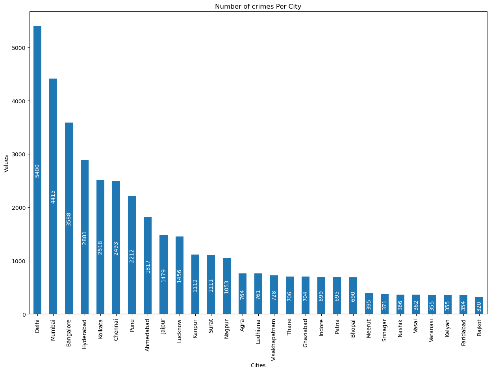
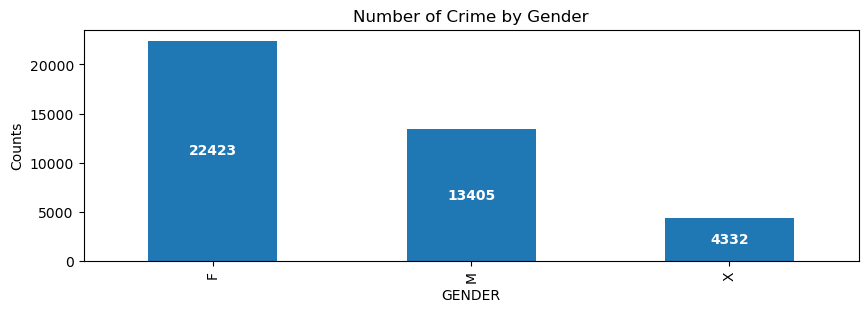
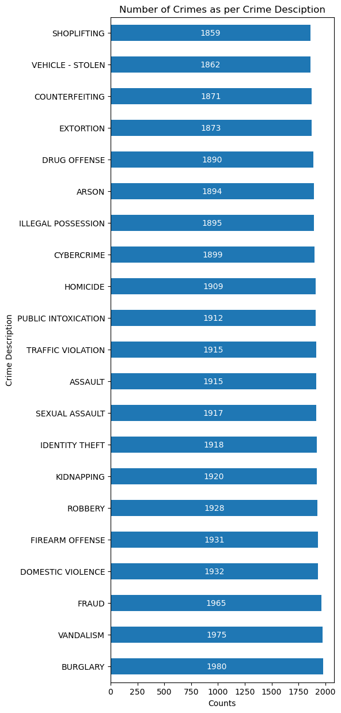
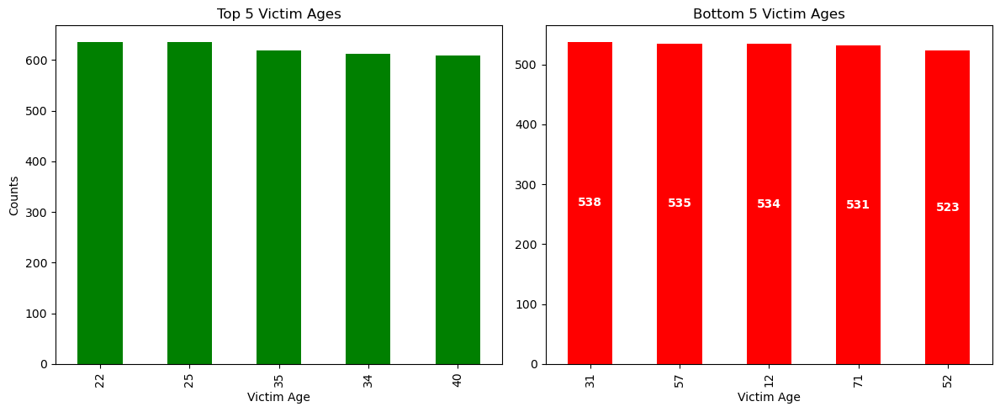
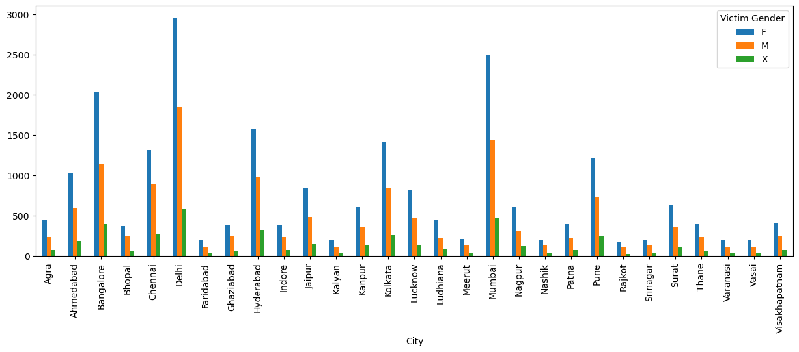
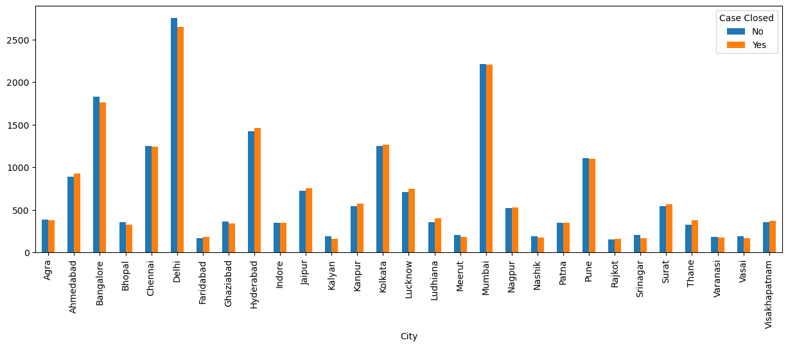
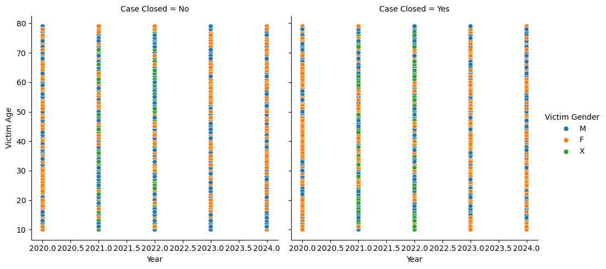
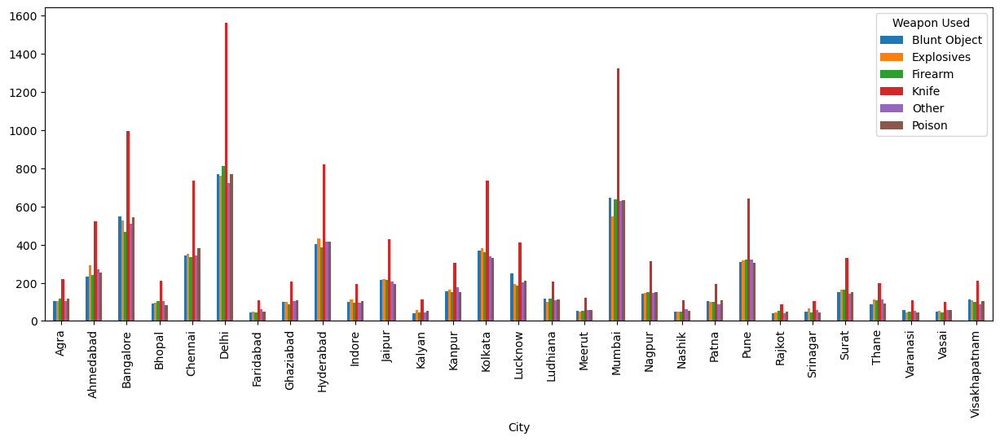

# 🚔 Indian Crime Data Analysis

An end-to-end Data Analysis project that explores crime trends across different states and union territories of India using Python. This project focuses on data cleaning, exploratory data analysis (EDA), and visualization to uncover meaningful patterns in crime statistics.

---

## 📌 Project Overview

Crime analysis helps identify patterns, trends, and high-risk areas, enabling better decision-making and policy planning. This project analyzes Indian crime data to answer key questions such as:

- Which states report the highest number of crimes?
- How have crime rates changed over time?
- Which crime categories are most common?
- What trends and patterns can be observed?

---

## 🎯 Objectives

- Clean and preprocess raw crime data.
- Perform Exploratory Data Analysis (EDA).
- Identify crime trends across states and years.
- Compare different crime categories.
- Generate meaningful business and policy insights through visualizations.

---

## 🛠️ Tools & Technologies

- Python
- Jupyter Notebook
- Pandas
- NumPy
- Matplotlib
- Seaborn

---

## 📂 Project Structure

```
Indian_Crime_Data_Analysis/
│
├── Indian Crime Data Analysis.ipynb
├── crime_dataset.csv
├── images/
├── README.md
└── requirements.txt
```

---

## 📊 Exploratory Data Analysis

The project includes:

- Data Cleaning
- Missing Value Handling
- Duplicate Value Checking
- Data Type Conversion
- Descriptive Statistics
- Univariate Analysis
- Bivariate Analysis
- Trend Analysis
- State-wise Crime Analysis
- Crime Category Analysis

---

## 📈 Visualizations

Some of the visualizations include:

- Crime Distribution
- Top States by Crime Count
- Year-wise Crime Trend
- Category-wise Crime Comparison
- Correlation Heatmap
- Bar Charts
- Line Charts
- Histograms
- Box Plots

---

## 🔍 Key Insights

- Identified states with the highest reported crime cases.
- Observed crime trends across multiple years.
- Compared crime categories to understand major contributors.
- Highlighted patterns that can support better planning and decision-making.

---

## 📷 Project Preview












## 🚀 Future Improvements

- Interactive Power BI Dashboard
- SQL Database Integration
- Predictive Crime Analysis using Machine Learning
- Geographical Crime Mapping
- Time Series Forecasting

---

## ▶️ How to Run

1. Clone the repository

```bash
git clone https://github.com/Dikshit1910/Indian_Crime_Data_Analysis.git
```

2. Install dependencies

```bash
pip install -r requirements.txt
```

3. Open the notebook

```bash
jupyter notebook
```

4. Run all cells.

---

## 📁 Dataset

The dataset contains crime statistics across different states and years in India.

Typical columns include:

- State/UT
- Year
- Crime Category
- Number of Cases

---

## 👨‍💻 Author

**Dikshit**
Data Analyst

### Skills

- Python
- SQL
- Excel
- Power BI
- Pandas
- NumPy
- Matplotlib
- Seaborn

---

## ⭐ If you found this project useful, don't forget to star the repository!
